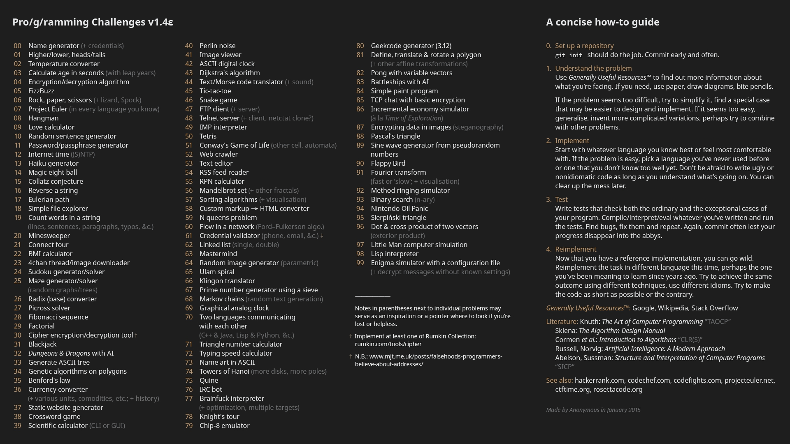

# Pro/g/ramming Challenges v1.4ε

| ID | Challenge | Languages |
|----|-----------|-----------|
| 00 | Name generator (+ credentials) | bash |
| 01 | Higher/lower | bash |
| 40 | Perlin noise | python |
